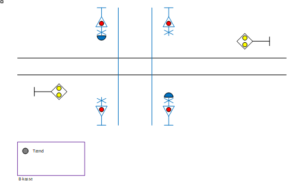

# Manuelt betjent varslingsanlæg
Til en modelbane bliver er der bygget en model af en overkørsel:
* For en station på en enkeltsporet strækning.
* Som varslingsanlæg med manuel betjening.

Model er bygget på breadboard og styres af en Arduino Uno. Modellen leverer.
* Trafikal beskrivelse.
* Softwarepakke til Arduino.
* Specifikation af tilslutning til hardware.
## Versionshistorik
Version	| Beskrivelse |
--------|------------
1.0 |	Første version  |
# Trafikal beskrivelse
Overkørsel består af:
* 2 uordenssignaler.
* 4 vejsignaler.
* 2 vejklokker.
* Betjeningskasse:
  * Knap for manuel tænd.

# Tilstande
Overkørsel kan være i følgende tilstande.
1. Ikke sikret.
   1. Uordenssignal viser ”ikke sikret”.
   2. Vejlys og klokker er slukket.
2. Forringning.
   1.	Vejlys blinker og klokker ringer.
   2.	Skifter tilstand efter 2 sekunder.
3. Sikret.
   1. Uordenssignal viser ”sikret”.
   2. Skifter tilstand efter 15 sekunder.
4. Opløsning på tid.
   1. Uordenssignal viser ”ikke sikret”.
   2. Skifter tilstand efter 15 sekunder.
5. Billisttid.
   1. Vejlys og klokker slukker.
   2. Varer i 10 sekunder.

SODB for overkørsler angiver meget længere tider, men det er længe at vente ved en modeljernbane.

Se i øvrigt ”Tilstandsdiagram”.

# Model med Arduino
Arduiono har følgende ind- og udgange:
1.	Indgang: Knap for manuel tænd.
2.	Udgang køreretning AB: Uordenssignal gul LED. 
3.	Udgang køreretning BA: Uordenssignal gul LED. 
4.	Udgang vejlys: Rød LED.
5.	Udgang vejklokker: Aktiv buzzer.

Prototype er opstillet på breadboard og får de I/O som er vist herover.
Vejlys er styret af effektelektronik med 1 indgang koblet til Arduino.

Se i øvrigt ”Breadboard”.
